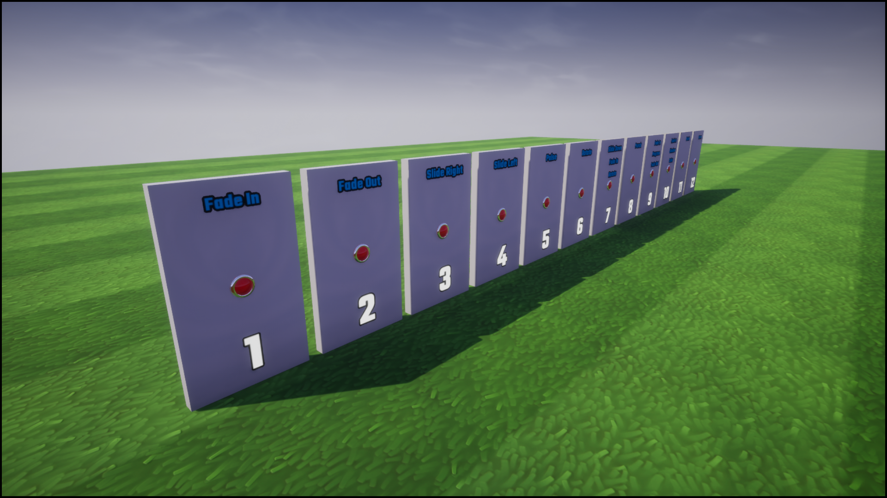
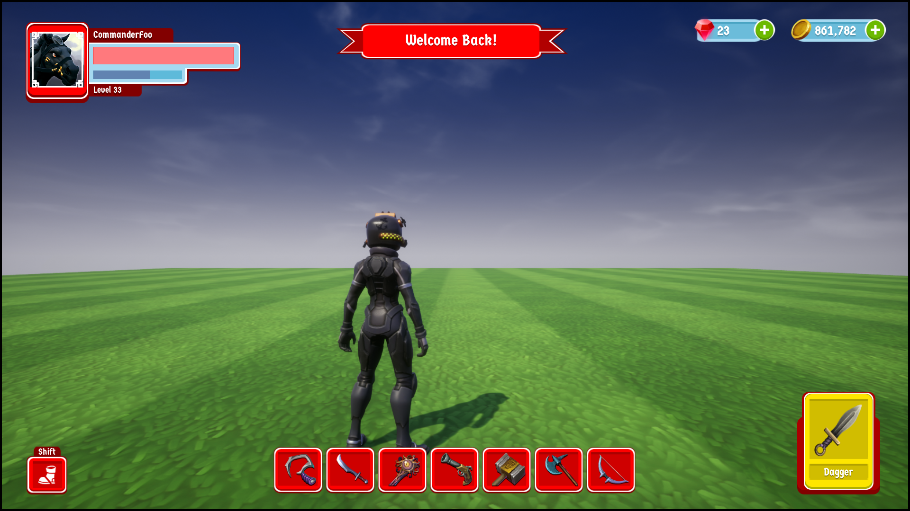
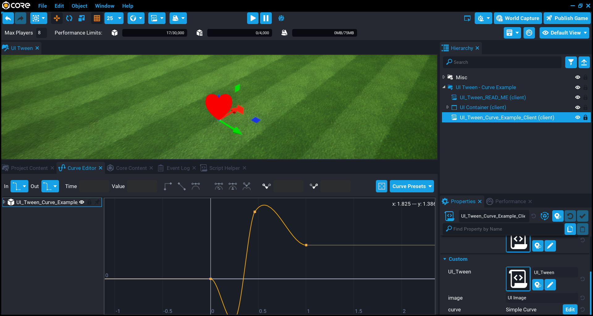

# Template Examples

**UI Tween** comes with 3 examples that you can try by dragging and dropping in the example you want to preview, into the **Hierarchy**.

1. **UI Tween - Basic Example**

	This template has 12 examples you can test in play mode by pressing the red buttons.

	

2. **UI Tween - Advanced Example [Lakwaai UI Kit]**

	This template uses the UI Kit by Lakwaai, and shows you how easy it is to get nice UI animations.

	

3. **UI Tween - Curve Example**

	This template shows you how a curve can be used to get some interesting animations.

	
